# Hydravibe Website — WEDE5011 Portfolio of Evidence

**Student:** Samantha George
**Student Number:** ST10502195
**Subject:** Web Development (WEDE5011)
**Organisation:** Hydravibe — a small skincare business (own brand)

---

## Project Overview

Hydravibe is a hydration-first skincare small business. This repository contains the
website built for Hydravibe across the assignment's parts: static HTML structure,
CSS styling, and responsive design.

**Goals & Objectives**
- Give Hydravibe a functional, trustworthy online presence
- Support product discovery and enquiries (no live checkout in this phase)
- Reflect the brand's hot pink + black visual identity
- Work cleanly across desktop, tablet and mobile screens

---

## Key Features

- 5 linked pages: Home, About, Products, Enquiry, Contact
- Hot pink (`#ff1178`) + black brand identity with a droplet motif
- Product catalogue (9 products) with an enquiry flow (no backend — front-end only)
- Two store locations with an embedded map on the Contact page
- Fully responsive layout (desktop / tablet / mobile) with a mobile nav menu
- Responsive images via `srcset`/`sizes` (product thumbnails) and `<picture>`
  (hero + story images)

---

## Sitemap

```
Home (index.html)
├── About (about.html)
├── Products (products.html)
│     └── links to → Enquiry
├── Enquiry (enquiry.html)
└── Contact (contact.html)
```

## File & Folder Structure

```
/
├── index.html
├── about.html
├── products.html
├── enquiry.html
├── contact.html
├── css/
│   └── style.css
├── js/
│   └── script.js
├── images/
│   ├── [product].jpg          (original, largest size)
│   ├── [product]-800w.jpg     (medium — used in srcset/picture)
│   └── [product]-480w.jpg     (small — used in srcset/picture)
└── screenshots/                (responsive testing evidence, see below)
```

---

## Part 1 — Building the Foundation

- Chose Hydravibe (small business/retail, skincare) as the target organisation
- Wrote the Website Project Proposal (goals, KPIs, features, design direction,
  technical requirements, timeline, budget)
- Built the HTML structure for all 5 pages with semantic tags (`header`, `nav`,
  `section`, `footer`, forms) and a working navigation system across the site

## Part 2 — Designing the Visuals: CSS Styling & Responsive Design

### 2. CSS Styling for Desktop
- Created one external stylesheet (`css/style.css`) linked from every page
- **Base style / reset:** a minimal CSS reset (`* { margin:0; padding:0;
  box-sizing:border-box }`) plus consistent base typography and colours set
  via CSS custom properties (`:root` variables for the hot pink/black palette)
- **Typography:** `font-family`, `font-size` (in `rem`), `font-weight`,
  `line-height` and `letter-spacing` applied through reusable heading/body
  classes (Playfair Display for headings, Poppins for body text)
- **Layout:** CSS Grid for page/card grids (`grid-template-columns`) and
  Flexbox for the nav, buttons and form rows (`display:flex`,
  `justify-content`, `align-items`)
- **Visual styling:** `color`, `background-color`, `border`, `box-shadow`,
  and rounded corners on cards/buttons, with `:hover`, `:focus-visible` and
  `:active` states on all interactive elements (buttons, nav links, form
  fields)
- **Cascading:** shared rules (buttons, cards, section spacing) are written
  once against a small number of reusable classes (`.btn`, `.card`-style
  patterns) rather than repeated per page, so the cascade does the heavy
  lifting
- **Animations:** `@keyframes` used for a hero entrance sequence (staggered
  fade/slide-up), a floating + pulsing glow on the droplet emblem, and
  scroll-triggered reveal animations on section grids — the reveal is
  powered by a small `IntersectionObserver` script (`js/script.js`) that
  adds an `.in-view` class the first time each element scrolls into frame;
  all animation durations are skipped for users with `prefers-reduced-motion`
  enabled

### 3. Responsive Design
- **Breakpoints identified and used:**
  - Desktop: default styles (> 900px)
  - Tablet: `max-width: 900px` — grids go from 3–4 columns to 2
  - Mobile (large): `max-width: 720px` — nav collapses into a hamburger menu
  - Mobile (small): `max-width: 560px` — grids go fully single-column,
    buttons stack and go full-width
- **Relative units:** `rem` for font sizes/spacing, `%` and `vw` for widths
  (e.g. image `sizes` attribute, container widths)
- **Responsive images:**
  - `srcset` + `sizes` on every product thumbnail (480w/800w/original), so
    the browser picks the right resolution for its viewport
  - `<picture>` with `<source media="...">` on the hero and story images,
    switching between a 480w and 800w asset at the 720px breakpoint
- **Cross-browser safety net:** the product image aspect ratio uses the
  modern `aspect-ratio` property with a `padding-top` percentage fallback
  (via `@supports`) for older browsers that don't support `aspect-ratio`
- **Tested in:** Chrome and Firefox desktop, plus Chrome DevTools device
  emulation for tablet (iPad-width) and mobile (390px-width) — screenshots
  below

---

## Responsive Screenshot Evidence

### Home (`index.html`)
| Desktop | Tablet | Mobile |
|---|---|---|
| 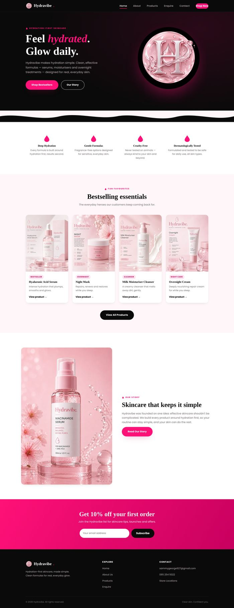 | 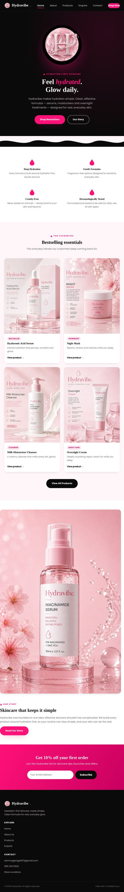 | 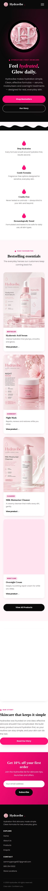 |

### About (`about.html`)
| Desktop | Tablet | Mobile |
|---|---|---|
| 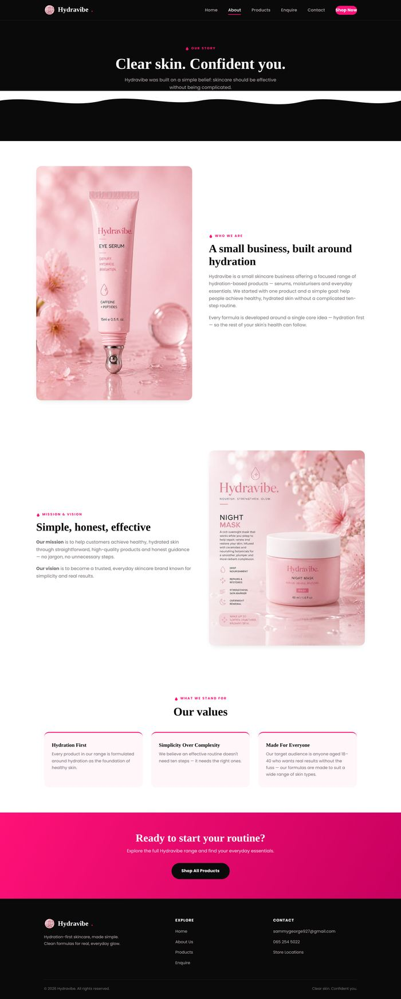 | 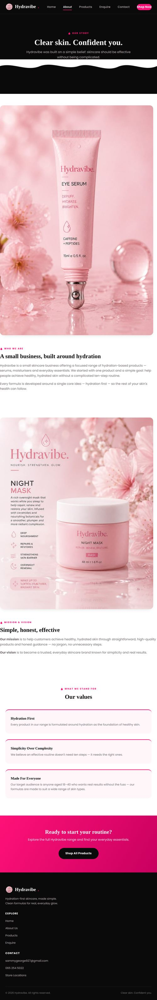 | 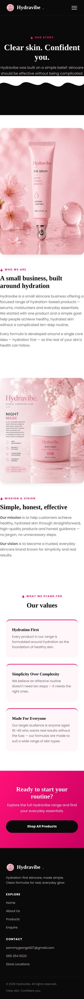 |

### Products (`products.html`)
| Desktop | Tablet | Mobile |
|---|---|---|
| 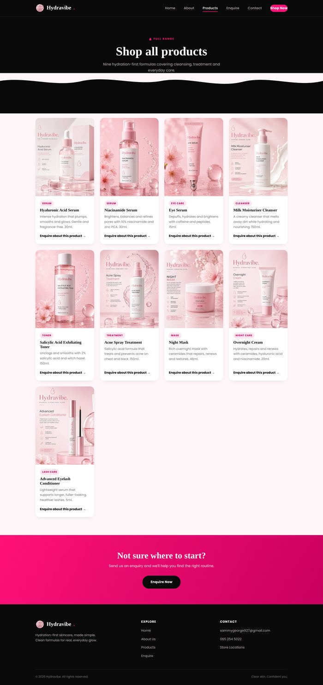 | 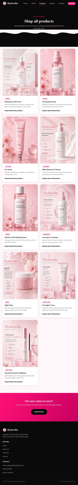 | 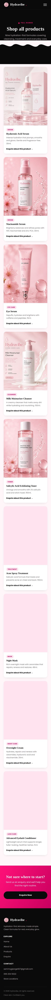 |

### Enquiry (`enquiry.html`)
| Desktop | Tablet | Mobile |
|---|---|---|
| 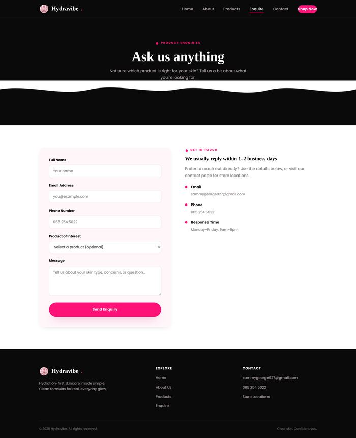 | 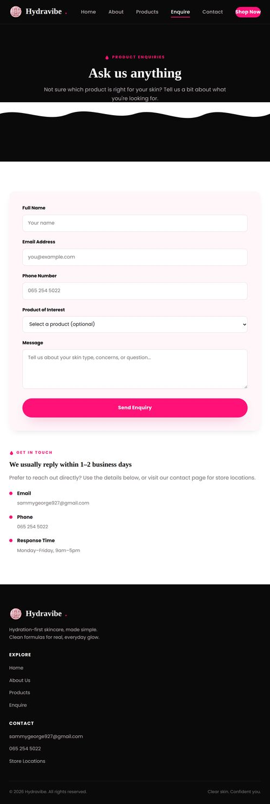 | 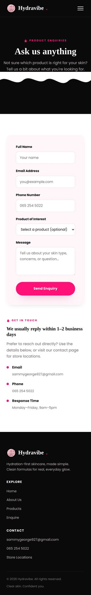 |

### Contact (`contact.html`)
| Desktop | Tablet | Mobile |
|---|---|---|
| 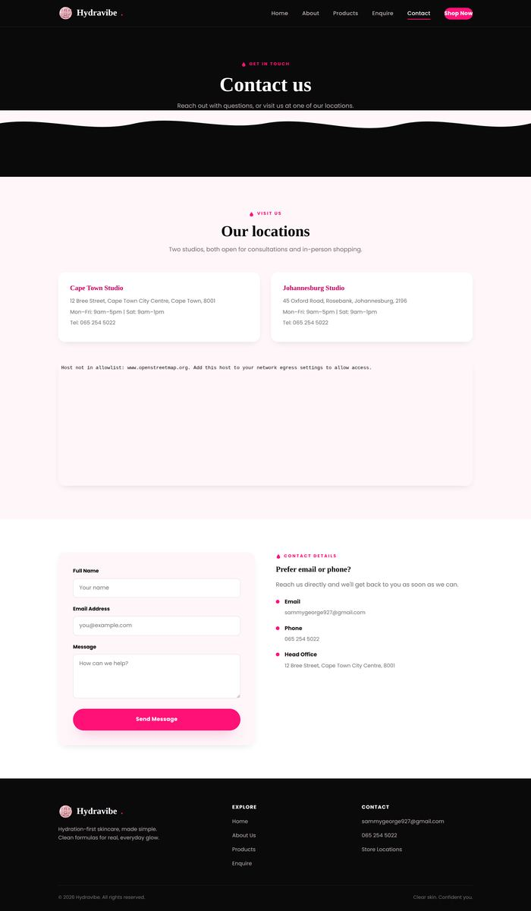 | 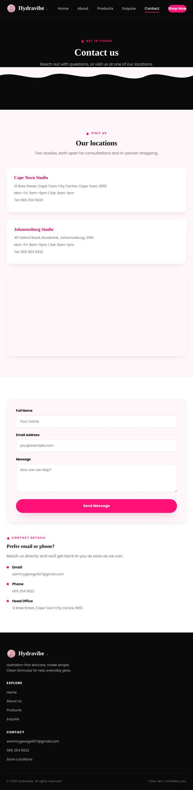 | 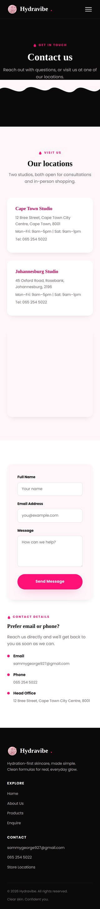 |

---

## Changelog

No lecturer feedback had been released for Part 1 at the time Part 2 was
started, so the entries below are a general self-review/polish pass rather
than feedback-driven corrections. Real feedback entries will be added here
under a new dated heading once marks are released.

### Part 2 — [Date of submission]
- **Added:** CSS animations — hero entrance (fade/slide-up on load), a
  floating + softly pulsing glow on the droplet emblem, and scroll-triggered
  fade/slide-in reveals on section grids (values, products, about cards,
  locations) via `@keyframes` + `IntersectionObserver`
- **Added:** `prefers-reduced-motion` support so animations are disabled for
  users who've asked their OS/browser to reduce motion
- **Added:** external stylesheet (`css/style.css`) linked to all 5 pages
- **Added:** CSS reset and base typography/colour system using CSS custom
  properties
- **Added:** full responsive layout with 3 breakpoints (900px / 720px / 560px)
  including a mobile hamburger navigation menu
- **Added:** `srcset`/`sizes` responsive images on all product thumbnails
  (index and products pages)
- **Added:** `<picture>` + `<source>` responsive images on hero and story
  images (index and about pages)
- **Added:** cross-browser `aspect-ratio` fallback (`padding-top` trick +
  `@supports`) for product thumbnail cards
- **Added:** `:hover`, `:focus-visible` and `:active` states on buttons and
  nav links
- **Fixed:** generated and resized dedicated `-480w`/`-800w` image assets so
  responsive images serve genuinely different file sizes rather than the
  same file at different densities
- **Tested:** all 5 pages at desktop, tablet and mobile widths using browser
  dev tools; screenshots captured and stored in `/screenshots`

### Part 1 — Initial submission
- Website Project Proposal completed for Hydravibe
- Initial HTML structure built for Home, About, Products, Enquiry and
  Contact pages with working navigation

---

## References

- W3Schools. HTML and CSS reference documentation. Available at:
  https://www.w3schools.com
- MDN Web Docs. `srcset`, `sizes`, and `<picture>` responsive images
  reference. Available at: https://developer.mozilla.org/en-US/docs/Web/HTML/Element/img
- MDN Web Docs. CSS `aspect-ratio` and `@supports`. Available at:
  https://developer.mozilla.org/en-US/docs/Web/CSS/aspect-ratio
- Google Fonts. Playfair Display and Poppins web fonts. Available at:
  https://fonts.google.com
- Coolors. Colour palette generator used to develop the hot pink/black
  colour scheme. Available at: https://coolors.co
